<!--
  Yomna Ashraf Elshorbagy — Profile README
  Custom-built, animated identity. Designed and assembled by hand.
  Each visual asset under /assets is a hand-authored animated SVG (SMIL + CSS),
  plus a hero motion banner. No templates, no copy-paste.
-->

<a href="https://github.com/yomna26ashraf">
  
</a>

<div align="center">

<a href="https://linkedin.com/in/yomna-ashraf-elshorbagy"></a>
<a href="mailto:yomna26ashraf@gmail.com"></a>
<a href="https://github.com/yomna26ashraf"></a>
<a href="https://www.coursera.org/professional-certificates/google-data-analytics"></a>

</div>

<div align="center">
  
</div>

<p align="center">
  
  
  
</p>


## ◢ /01 · IDENTITY

```python
yomna = {
    "role":       "Data Analyst · SQL · Python · Power BI",
    "main_track": "Cleaning, analysis, visualization, decision-ready dashboards",
    "next_track": "Applied AI & Machine Learning (Digital Pioneers / MCIT)",
    "background": "Computer Teacher Education → Data Analytics",
    "obsessions": ["clean data", "clear decisions", "honest charts", "growth"],
    "superpower": "Turning 50,000+ messy rows into something a team can act on.",
    "currently":  "Analyzing by day. Going deeper into ML & AI agents by night.",
}
```

I'm **Yomna** — a data analyst with a background in education and a growing focus on
**applied AI**. My day-to-day lives in **SQL, Python, and Power BI**: I clean, analyze,
and visualize data, then turn it into dashboards and insights that actually change how
teams decide. I've processed datasets with **50,000+ records**, shipped **interactive
dashboards**, and I'm now building real depth in **machine learning and AI agent systems**.

<table>
<tr>
<td width="50%" valign="top">

### ◢ DATA / ANALYTICS  ·  *main track*
- **SQL** · Microsoft SQL Server · joins · filtering
- **Python** · Pandas · NumPy (cleaning, EDA)
- **Power BI** · dashboard design · data modeling
- Excel · pivot tables · statistical analysis
- Insight-first storytelling for non-technical readers

</td>
<td width="50%" valign="top">

### ◢ APPLIED AI / ML  ·  *growing track*
- **scikit-learn** · classification · churn modeling
- **PyTorch** · Vision Transformer · MobileNetV2
- LSTM forecasting · XGBoost · agentic AI systems
- Feature engineering, train/test design, evaluation
- Translating *what happened* → *what to do next*

</td>
</tr>
</table>


## ◢ /02 · STACK · ORBITAL VIEW

<a href="https://github.com/yomna26ashraf">
  
</a>

<div align="center">

  <sub><b>DATA · BI · ANALYTICS — main track</b></sub><br/>
  
  
  
  
  
  <br/>
  <sub><b>PYTHON · MACHINE LEARNING — growing track</b></sub><br/>
  
  
  
  
  
  <br/>
  <sub><b>VISUALIZATION · TOOLS — craft layer</b></sub><br/>
  
  
  
  
  

</div>


## ◢ /03 · FEATURED · GRADUATION PROJECT

<table>
<tr>
<td width="62%" valign="top">

<a href="https://github.com/yomna26ashraf">
  
</a>

</td>
<td width="38%" valign="top">

### `Agentic AI · Precision Agriculture`
**Plant disease detection + water management**

An integrated **agentic AI** system for Egypt's Al-Maghara region.
Three models under one orchestrating core: a **Vision Transformer**
+ **MobileNetV2** for cucumber leaf disease detection (4,445 images),
an **LSTM** early-warning model on IoT sensor streams, and **XGBoost**
for water-quality prediction. Targets **99.39%** classification
accuracy and runs on edge devices like Raspberry Pi.

`PyTorch` · `ViT` · `LSTM` · `XGBoost` · `Agentic AI`

<sub>Supervised by Dr. Tarek Ghoniemy</sub>

</td>
</tr>
</table>


## ◢ /04 · SHOWCASE

<table>
<tr>
<td width="50%" valign="top">

#### [BankIQ — Banking Database System →](https://github.com/yomna26ashraf)
`SQL` · `SQL Server` · `Data Modeling`

A banking database with **16 relational tables**: schema design,
data insertion, and complex queries for business insights —
customer segmentation, transaction analysis, and campaign
performance, with bilingual documentation.

</td>
<td width="50%" valign="top">

#### [Customer Churn Prediction →](https://github.com/yomna26ashraf)
`Python` · `scikit-learn` · `ML`

Predicts *why customers leave*. Identifies churn patterns and the
factors most tied to attrition — pairing predictive modeling with
business framing to move from "what happened" to "what to do next."

</td>
</tr>
<tr>
<td width="50%" valign="top">

#### [Body Performance — ML Classification →](https://github.com/yomna26ashraf)
`Python` · `scikit-learn` · `Pandas`

Classifies fitness performance levels from health data. Full
pipeline: cleaning, feature engineering, training, evaluation —
benchmarked across 50/50, 70/30 and 80/20 splits.

</td>
<td width="50%" valign="top">

#### [Google Data Analytics →](https://www.coursera.org/professional-certificates/google-data-analytics)
`Spreadsheets` · `SQL` · `Dashboards`

Professional Certificate covering data cleaning, analysis,
visualization, SQL and dashboard design — the foundation behind
the analytics work above.

</td>
</tr>
</table>


## ◢ /05 · TELEMETRY

<div align="center">


</div>

<div align="center">

</div>

### ◢ ANALYTICS WORKBENCH · LIVE PANEL

<a href="https://github.com/yomna26ashraf">
  
</a>

### ◢ ACTIVITY WAVEFORM

<div align="center">
  
</div>

### ◢ CONTRIBUTION GRID · ANIMATED

<div align="center">
  <picture>
    <source media="(prefers-color-scheme: dark)" srcset="https://raw.githubusercontent.com/yomna26ashraf/yomna26ashraf/output/github-contribution-grid-snake-dark.svg"/>
    <source media="(prefers-color-scheme: light)" srcset="https://raw.githubusercontent.com/yomna26ashraf/yomna26ashraf/output/github-contribution-grid-snake.svg"/>
    
  </picture>
</div>


## ◢ /06 · PHILOSOPHY

<table>
<tr>
<td width="33%" valign="top" align="center">

### ♡ CLARITY
A number is only useful if<br/>
someone can act on it.

</td>
<td width="33%" valign="top" align="center">

### ✿ CARE
Clean data and honest charts<br/>
are a form of respect.

</td>
<td width="33%" valign="top" align="center">

### ✦ GROWTH
From classrooms to models —<br/>
always learning the next layer.

</td>
</tr>
</table>

```text
clean the data  ·  frame the question  ·  design the answer  ·  ship something kind & clear
```


<a href="mailto:yomna26ashraf@gmail.com">
  
</a>

<div align="center">

<a href="mailto:yomna26ashraf@gmail.com"></a>
<a href="https://linkedin.com/in/yomna-ashraf-elshorbagy"></a>
<a href="https://github.com/yomna26ashraf"></a>

<sub><i>This README is hand-coded — the hero banner is custom motion art and every
animation below is a hand-authored SVG. No templates. Clean the data, tell the truth,
make it pretty. ♡</i></sub>

</div>
