<!--
  Yomna Ashraf Elshorbagy — Profile README
  "Pastel Data Studio" — an original, hand-authored design.
  Every visual under /assets is a hand-coded animated SVG (SMIL), plus a motion hero.
  Light, cozy, scrapbook aesthetic. No templates, no copy-paste.
-->

<a href="https://github.com/yomna26ashraf">
  
</a>

<div align="center">

<a href="https://linkedin.com/in/yomna-ashraf-elshorbagy"></a>
<a href="mailto:yomna26ashraf@gmail.com"></a>
<a href="https://github.com/yomna26ashraf"></a>
<a href="https://www.coursera.org/professional-certificates/google-data-analytics"></a>

</div>

<div align="center">
  
</div>

<p align="center">
  
  
  
</p>


## ✿ hello, i'm yomna

<table>
<tr>
<td valign="top">

```python
yomna = {
    "role":       "Data Analyst · SQL · Python · Power BI",
    "main_track": "cleaning · analysis · decision-ready dashboards",
    "next_track": "Applied AI & Machine Learning (Digital Pioneers / MCIT)",
    "background": "Computer Teacher Education → Data Analytics",
    "loves":      ["clean data", "honest charts", "clear decisions"],
    "superpower": "turning 50,000+ messy rows into something a team can act on",
}
```

</td>
</tr>
</table>

I'm **Yomna** — a data analyst from **Damietta, Egypt** with a background in education and a
growing focus on **applied AI**. My day-to-day lives in **SQL, Python, and Power BI**: I clean,
analyze, and visualize data, then turn it into dashboards and insights that actually change how
teams decide. I've wrangled datasets of **50,000+ records**, shipped **interactive dashboards**,
and I'm now building real depth in **machine learning and AI agent systems**.

<table>
<tr>
<td width="50%" valign="top">

### 🌸 data / analytics · *main track*
- **SQL** · Microsoft SQL Server · joins · filtering
- **Python** · Pandas · NumPy (cleaning, EDA)
- **Power BI** · dashboard design · data modeling
- Excel · pivot tables · statistical analysis
- insight-first storytelling for non-technical readers

</td>
<td width="50%" valign="top">

### 💜 applied AI / ML · *growing track*
- **scikit-learn** · classification · churn modeling
- **PyTorch** · Vision Transformer · MobileNetV2
- LSTM forecasting · XGBoost · agentic AI systems
- feature engineering, train/test design, evaluation
- translating *what happened* → *what to do next*

</td>
</tr>
</table>


## 🌷 my little skill garden

<a href="https://github.com/yomna26ashraf">
  
</a>

<div align="center">

  <sub><b>🌸 data · BI · analytics</b></sub><br/>
  
  
  
  
  <br/>
  <sub><b>💜 python · machine learning</b></sub><br/>
  
  
  
  
  
  <br/>
  <sub><b>🍑 visualization · tools</b></sub><br/>
  
  
  
  
  

</div>


## 🌟 featured project — agentic AI for precision agriculture

> **Plant disease detection + water management** — my graduation project 🌿

An integrated **agentic AI** system for Egypt's Al-Maghara region. Three models under one
orchestrating core: a **Vision Transformer** + **MobileNetV2** for cucumber leaf disease
detection (4,445 images), an **LSTM** early-warning model on IoT sensor streams, and
**XGBoost** for water-quality prediction. Targets **99.39%** classification accuracy and
runs on edge devices like Raspberry Pi.

<p>
  
  
  
  
  
</p>

<sub>Supervised by Dr. Tarek Ghoniemy ♡</sub>


## 🧺 things i've built

<table>
<tr>
<td width="50%" valign="top">

#### [🏦 BankIQ — Banking Database System →](https://github.com/yomna26ashraf)
`SQL` · `SQL Server` · `Data Modeling`

A banking database with **16 relational tables**: schema design,
data insertion, and complex queries for business insights —
customer segmentation, transaction analysis, and campaign
performance, with bilingual documentation.

</td>
<td width="50%" valign="top">

#### [💳 Customer Churn Prediction →](https://github.com/yomna26ashraf)
`Python` · `scikit-learn` · `ML`

Predicts *why customers leave*. Identifies churn patterns and the
factors most tied to attrition — pairing predictive modeling with
business framing to move from "what happened" to "what to do next."

</td>
</tr>
<tr>
<td width="50%" valign="top">

#### [🏃‍♀️ Body Performance — ML Classification →](https://github.com/yomna26ashraf)
`Python` · `scikit-learn` · `Pandas`

Classifies fitness performance levels from health data. Full
pipeline: cleaning, feature engineering, training, evaluation —
benchmarked across 50/50, 70/30 and 80/20 splits.

</td>
<td width="50%" valign="top">

#### [🎓 Google Data Analytics →](https://www.coursera.org/professional-certificates/google-data-analytics)
`Spreadsheets` · `SQL` · `Dashboards`

Professional Certificate covering data cleaning, analysis,
visualization, SQL and dashboard design — the foundation behind
the analytics work above.

</td>
</tr>
</table>


## 📈 my github, in charts

<a href="https://github.com/yomna26ashraf">
  
</a>

<div align="center">


</div>

<div align="center">

</div>

<div align="center">
  
</div>

<div align="center">
  <picture>
    <source media="(prefers-color-scheme: dark)" srcset="https://raw.githubusercontent.com/yomna26ashraf/yomna26ashraf/output/github-contribution-grid-snake-dark.svg"/>
    <source media="(prefers-color-scheme: light)" srcset="https://raw.githubusercontent.com/yomna26ashraf/yomna26ashraf/output/github-contribution-grid-snake.svg"/>
    
  </picture>
</div>


## 💌 let's talk

<a href="mailto:yomna26ashraf@gmail.com">
  
</a>

<table>
<tr>
<td width="33%" valign="top" align="center">

### ♡ clarity
a number is only useful<br/>if someone can act on it.

</td>
<td width="33%" valign="top" align="center">

### ✿ care
clean data and honest charts<br/>are a form of respect.

</td>
<td width="33%" valign="top" align="center">

### ✦ growth
from classrooms to models —<br/>always learning the next layer.

</td>
</tr>
</table>

<div align="center">

<a href="mailto:yomna26ashraf@gmail.com"></a>
<a href="https://linkedin.com/in/yomna-ashraf-elshorbagy"></a>
<a href="https://github.com/yomna26ashraf"></a>

<sub><i>hand-coded with care — the hero is custom motion art and every animation is a
hand-authored SVG. no templates. clean the data, tell the truth, make it pretty. ♡</i></sub>

</div>
